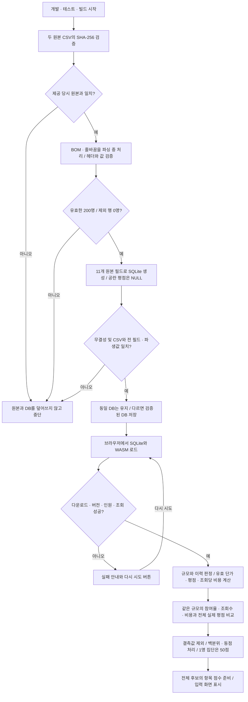
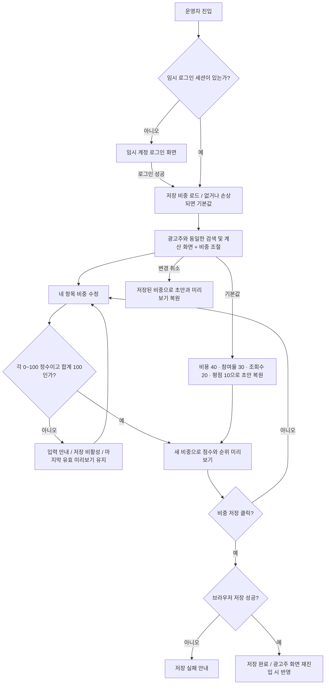

# 추천 로직 흐름

현재 구현 기준입니다. 데이터 준비, 검색과 결과, 운영자 비중 변경을 나누어 표시합니다.

## 1. 원본 검증과 데이터 로드

과거 단가가 없거나 평균 조회수가 0이면 조회당 비용은 `null`입니다. 평점 공란을 0점으로 바꾸지 않습니다. 점수에 필요한 실제 데이터가 없는 이력 후보는 종합 순위에 포함하지 않습니다.

## 2. 입력에서 결과까지

```mermaid
flowchart TD
    A[플랫폼 · 1명당 예산 · 규모 · 복수 카테고리 · 이력 입력] --> B{예산은 양의 안전한 정수이며 규모와 카테고리를 선택했는가?}
    B -- 아니오 --> C[검색 버튼 비활성 / 조작한 입력에 오류 표시]
    C --> A
    B -- 예 --> D[크리에이터 찾기 클릭 / 검색 조건 확정]
    D --> E[실측값이 있는 이력 후보의 항목 점수를 저장 비중으로 합산]
    E --> F[플랫폼 AND 카테고리 중 하나 AND 규모 AND 단가가 예산 이하]
    F --> G{이력 후보 수}
    G -- 0명 --> H[검색 조건 중 정확히 하나만 어긋나는 이력 후보 탐색]
    H --> I{근접 후보가 있는가?}
    I -- 예 --> J[매칭 점수순 최대 3명과 바꿀 조건 표시]
    I -- 아니오 --> K[조건을 바꿔 다시 검색하라는 안내]
    G -- 1명 이상 --> L[매칭 점수순 표 / 지표별 정렬 / 계산 내역 펼침]
    L --> M{1~2명인가?}
    M -- 예 --> N[조건 변경 선택지와 변경 후 인원 표시]
    N -- 사용자가 선택 --> P[선택한 조건을 입력 폼에 반영하고 재검색]
    P --> D
    M -- 아니오 --> Q[현재 결과 유지]
    D --> R{이력 있는 후보만 선택?}
    R -- 예 --> S[신규 표 숨김]
    R -- 아니오 --> T[캠페인 0건 후보에 플랫폼 · 카테고리 · 규모 적용]
    T --> U[별도 표와 예산 충족 미확인 안내 / 없으면 0명 안내]
    U --> V[기본 참여율순 / 팔로워 · 조회수 재정렬 / 종합점수 없음]
```

검색 결과 안에서 항목 점수를 다시 계산하지 않습니다. 정렬을 바꾸면 표시 순서만 바뀝니다. 입력만 수정한 상태에서는 이전 검색 결과를 유지하고 검색 버튼을 누르면 갱신합니다. 신규 표는 이력 후보가 0명인 경우에도 표시할 수 있습니다.

## 3. 운영자 비중 조절

임시 로그인과 저장 비중은 해당 브라우저에만 유지됩니다. 외부 서버 인증이나 여러 사용자에게 공유되는 설정은 구현 범위에 포함하지 않습니다.
